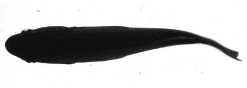
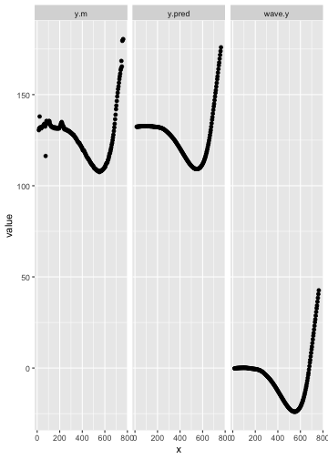
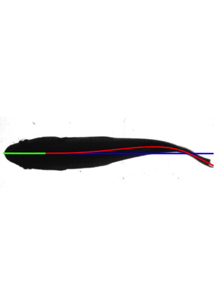
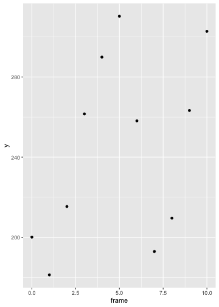
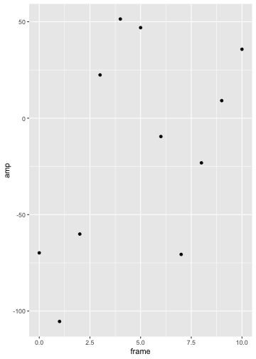
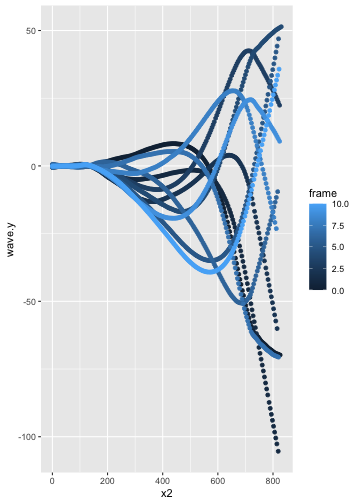
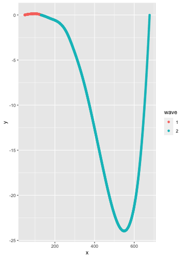
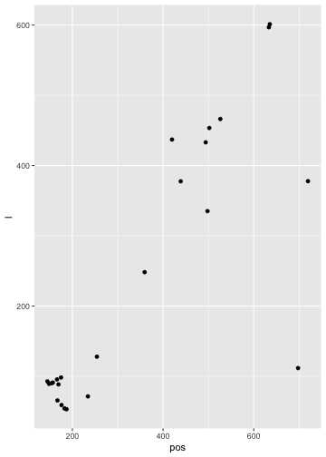

## Installation

The release version of *trackter* can be installed with:


```r
install.packages("trackter")
```

The current development version can be installed with:


```r
    require(devtools)
    install_github("ckenaley/trackter")
    require(trackter)
```
    

## External dependencies

The core functions of *trackter* that extract shape and contour data from images ( `kin.simple` and `kin.search`) depend upon *EBImage*, available on the Bioconductor repository. The current build and development versions of *trackter* install this dependency. If it does not install, it can be done so easily with just a few lines of code: 


```r
  if (!requireNamespace("BiocManager", quietly = TRUE))
   install.packages("BiocManager")
   BiocManager::install("EBImage")
```

*trackter* also contains several functions for image and video processing. These functions depend on the popular `FFmpeg` package and it must be installed if the user intends to use them. Installation is platform-dependent. I found the [`FFmpeg` wiki installation and compilation guide to be quite useful](https://trac.ffmpeg.org/wiki/CompilationGuide).

## Features

__Automated kinematic analysis__

* Fast and accurate contour and shape analysis of ROIs.
* ROI detection with search parameters including position and size.
* Relevant functions: `kin.search` and `kin.simple`.

__Tools for kinematic analysis of swimming animals__

* Calculate midline (propulsive) wavelength, trailing-edge frequency, paired-fin position.
* Relevant functions: `amp.freq`, `halfwave`, `wave`, and `fin.kin`

__Tools for image and video processing using FFmpeg__

* Access `FFmpeg` functionality, including filters and codecs, to extract frames, stitch videos, and edit images and videos.

* Relevant functions: `images.to.videos`, `images.to.videos2`, `vid.to.images`, and `vid.to.images2`

__Other miscellaneous, low-level tools for kinematic analysis__

* Compute distances in 2d space, angles, heading/bearing, convert radians to degrees and vice versa.
* Relevant functions: `dist.2d`, `cosine.ang`, `bearing.xy`, `deg`, `rad`


## Examples


```r
library(trackter)
library(ggplot2)
library(data.table)
```


### Analyzing a single image

*trackter* was developed to analyze image data from videos of swimming fishes, although any object in an image field has potential for analysis. Here, we start by accessing an image of a swimming fish included with the package in a directory named "img" and displaying it.


```r

i <- system.file("extdata/img","sunfish_BCF.jpg",package="trackter")
y <- EBImage::readImage(i)


EBImage::display(y,method="raster")
```



Here, `kin.simple` is used to extract contour and shape information from the image above by refering to the directory that contains it. An image with a midline overlay is saved to the working directory (see below).


```r

dir <- system.file("extdata","img",package="trackter")

kin.y <- kin.simple(image.dir = dir,out.dir = getwd())

```

The `kin` functions in *trackter* return a list of data tables/data frames:

```r
print(sapply(kin.y,class))
#> $kin.dat
#> [1] "data.table" "data.frame"
#> 
#> $midline
#> [1] "data.table" "data.frame"
#> 
#> $cont
#> [1] "data.table" "data.frame"
#> 
#> $all.classes
#> [1] "data.table" "data.frame"
#> 
#> $dim
#> [1] "integer"
```

Most will be interested in the "kin.dat" and "midline" data for the calculation of body shape and position parameters (e.g., amplitude, wavelength, etc.). For example, "kin.dat" table includes, among other things, frame-specific trailing-edge (rightmost) amplitude ("x", "y"), head (leftmost) position ("head.x", "head.y") which may be used to calculated position and trailing-edge amplitude.


```r
print(kin.y$kin.dat)
#>    frame   x        y head.x   head.y      amp head.pval roi  edge   size
#> 1:     0 756 176.0573     22 132.2365 42.62656 0.1306207   a FALSE 169710
```

The "midline" table is composed of frame-specific midline data, including, among other things, calculated midline position ("y.m"), smoothed midline position ("y.pred") and midline position relative to the head ("wave.y"). Here we see the difference between them.


```r

print(kin.y$midline)
#>      frame   x y.min y.max      y.m   y.pred mid.pred      wave.y roi
#>   1:     0  15   126   135 130.5000 132.3461 132.5498 -0.20372689   a
#>   2:     0  18   120   143 131.5000 132.3691 132.5529 -0.18381828   a
#>   3:     0  22   115   150 138.0000 132.4017 132.5571 -0.15542465   a
#>   4:     0  26   110   154 132.0000 132.4348 132.5613 -0.12656612   a
#>   5:     0  30   107   157 132.0000 132.4665 132.5655 -0.09904049   a
#>  ---                                                                 
#> 196:     0 747   153   178 168.5000 167.6151 133.3169 34.29822631   a
#> 197:     0 751   154   180 165.4545 169.6958 133.3211 36.37466631   a
#> 198:     0 755   178   181 179.5000 171.7898 133.3253 38.46451082   a
#> 199:     0 759   179   181 180.0000 173.8828 133.3295 40.55329642   a
#> 200:     0 763   180   181 180.5000 175.9602 133.3337 42.62655968   a
ml <- melt(kin.y$midline[,.(x,y.m,y.pred,wave.y)],"x")
qplot(data=ml,x=x,y=value)+facet_wrap(variable~.)
```



When "save=TRUE" (the default), the `kin` functions write images to a user-defined directory that include midline overlays.


```r

y2 <- EBImage::readImage("sunfish_BCF_000.jpg")
EBImage::display(y2,method="raster")
```



```r

#clean up
unlink("sunfish_BCF_000.jpg")
```


### Analyzing a video and multiple images

Of course, the primary utility of automated tracking routines is to process many images (i.e., frames). The `kin` functions analyze all the images in a subdirectory and assume they are ordered by a numbered suffix. One can use the `FFmpeg` wrappers `vid.to.images` or `vid.to.images2` to extract a numbered sequence from a video. Users may otherwise produce an image sequence from their videos using other software (e.g., ImageJ). Here, `vid.to.images` extracts images from a video in the package's "vid" directory of a swimming fish to a new directory named "img2". 


```r

#construct video file path
v <- system.file("extdata/vid","sunfish_BCF_red.avi",package="trackter")

#create new directory to store images
dir.create(paste0(getwd(),"/img2"))

#extract images from video and output to new "img2" directory
vid.to.images(v,out.dir=paste0(getwd(),"/img2"))  
```

The images are then passed through `kin.simple`. The threshold value for segmenting is set to 0.6 and the head section ("ant.per") set to 0.2 in this case.


```r
  kin.y2 <- kin.simple(image.dir =paste0(getwd(),"/img2"),thr=0.6,ant.per = 0.2,save = FALSE)

#clean up
unlink(paste0(getwd(),"/img2"),recursive = TRUE)
```


Now we can have a look at trailing-edge position and amplitude (relative to the head path) across the frames. 


```r
qplot(data=kin.y2$kin.dat,x=frame,y=y) #position
```



```r
qplot(data=kin.y2$kin.dat,x=frame,y=amp) #amplitude relative to a theoretical midline established by head
```



The midline data can be accessed to assess the waveform. Here, midline x position is standardized.


```r
kin.y2$midline[,x2:=x-x[1],by=frame]

#wave form plot
qplot(data=kin.y2$midline,x=x2,y=wave.y,col=frame)
```




### Downstream analyses of kinematic data

*trackter* supplies several functions for downstream analysis of kinematic data extracted from image frames. For instance, `half.wave` computes the midline half wavelength (i.e., propulsive wavelength in pixels) from a data table of x and y position data. These and other functions are intended for use with output from the `kin` functions.


```r
w <- halfwave(x=kin.y$midline$x,y=kin.y$midline$wave.y,method="zeros")
print(w)
#> $method
#> [1] "zeros"
#> 
#> $names
#>               x             y wave
#>    1:  47.55428  0.0004361881    1
#>    2:  47.92846  0.0023318403    1
#>    3:  48.30265  0.0042170273    1
#>    4:  48.67684  0.0060985870    1
#>    5:  49.05103  0.0079761220    1
#>   ---                             
#> 1681: 676.18859 -0.6984951756    2
#> 1682: 676.56278 -0.5275296899    2
#> 1683: 676.93697 -0.3560497970    2
#> 1684: 677.31116 -0.1840936920    2
#> 1685: 677.68534 -0.0116995699    2
#> 
#> $dat
#>    wave zeros wave.begin wave.end begin.index end.index         l       amp1
#> 1:    1    88   47.55428 129.2496          88       308  82.69535  0.1416087
#> 2:    2   309  130.24962 677.0595         309      1772 547.80990 23.9667273
#>    amp2     pos1 pos2
#> 1:   NA 100.6888   NA
#> 2:   NA 548.9650   NA
```
Using a "zeros" method, `half.wave` determines two half waves from the ROI in the single image above, described in the "dat" table from the output. The "names" table can be used to visualize the half wavelengths.


```r
qplot(data=w$names,x=x,y=y,col=wave)
```



We could extend this framework using `data.table` to calculate half waves in each of the 11 frames from the example video.


```r
 wave.dat <- kin.y2$midline[, { w <- halfwave(x,wave.y,method="zeros")$dat;
 list(l=as.numeric(w$l),
 	amp=as.numeric(w$amp1),
 	pos=as.numeric(w$pos1),
 	start=as.numeric(w$wave.begin),
 	end=as.numeric(w$wave.end))},
	 by=.(frame)]

qplot(data=wave.dat,x=pos,y=l)
```



